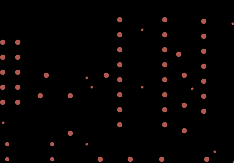
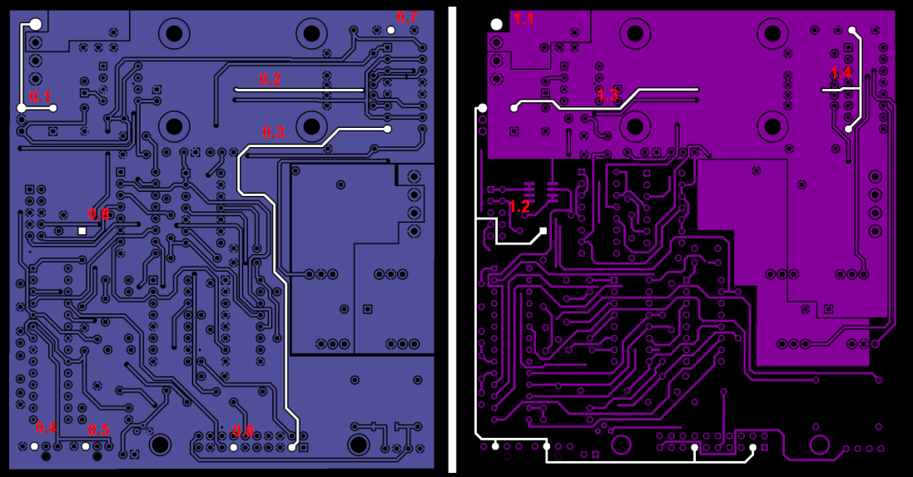
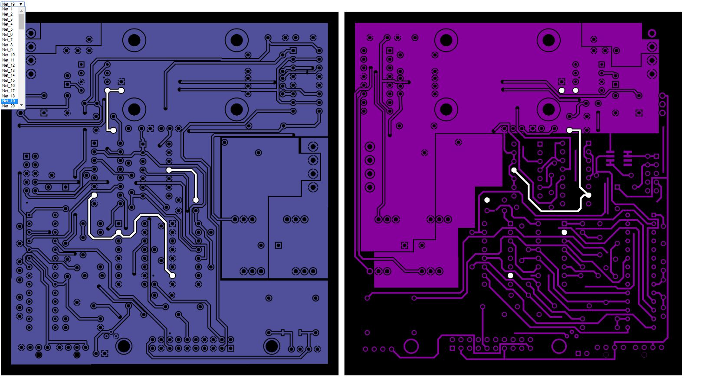

# DotNetlist
## Rebuild the netlist from a PCB

This projects aims at reverse engineering PCB's (Printed Circuit Boards) given as bitmap of the needed layers.
Currently only two copper layers are one drill layer are supported.

Starting from these aligned defined in the PNG format, DotNetlist performs the following operations

1. Finds the connected pixels, i.e. all the pixels that are in electrical connection with themselves on each copper layer.
2. Recognizes the center of the holes analyzing the bitmap of the drill layer
3. Connects the top and bottom layers connected through vias or other holes
4. Builds an HTML and related bitmaps to browse the nets found.

## Connection

Given a set of points, the mathematical relation of "Point A is electrically connected to B" has the following properties

* each point A is connected to itself
* if A is connected to B, then B is connected to A
* if A is connected to B and B is connected to C, then A is connected to C.

These properties define an equivalence relation among the connected points therefore the points, i.e. pixels, composing each layer are divided into equivalence classes by means of this relation.
and 
This also means that these pixels are divided into subsests mutually disconnected.

Consider the following simple PCB. Pixels made of copper are green.

In this case we recognize four nets, i.e. four areas of the circuit board that are in electrical connection. This means that if we touch with a tester any two points belonging to the same area, we will measure connection. If we touch areas belonging to different areas, no current can flow.

These colors show the five different areas or **nets**, as they are referred to in electronics.

The algorithm scans the bitmap and builds this equivalence partition of both the top and bottom copper layer given.

Nets are numbered sequentially and each one is identified by an integer number starting from 1.

## Holes
The same algorithm is used for the hole layer in PNG format of which an example is this one.

For sake of simplicity, the same connection algorithm is used for this bitmap as well, with an additional check that the net being scanned has an almost circular form, so each net identifier will be the identifier of the corresponding hole as well. 
Then the center of the node is computed so the list of coordinates of the center of each node is built.

## Top and bottom connection

Once the top and bottom nets are recognized and the list of hole centers is available, then it is possible to connect the nets of both layers by means of the metallized holes. The algorithm must take into account the fact that a single global net may be composed of many unconnected nets on both layers.

In this case, for instance, the top layer to the left has 8 independent nets numbered from 0.1 to 0.8 and the bottom layer to the right has four independent nets numbered from 1.1 to 1.4.

The final step of the algorithm recognizes which holes connect which nets of each layer thus recognizing that a single net is actually composed by 12 independent nets on each layers.

## HTML generation

Once the connection is completely determined, a folder is created where a number of copies of both the layers (top and bottom)are generated with only one net highligted in white and an HTML file is generated that refers to these picture so as to create a simple GUI like the following

There is a drop down menu top left from which each signle global net can be selected and the corresponding net is correspondingly highlighted. 
